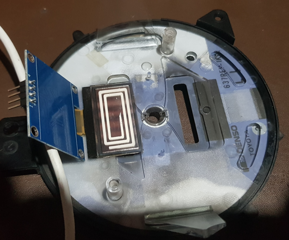
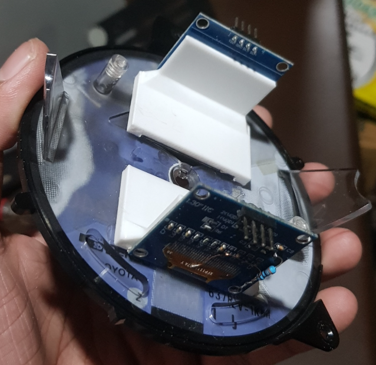
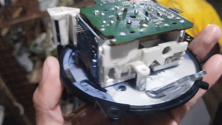
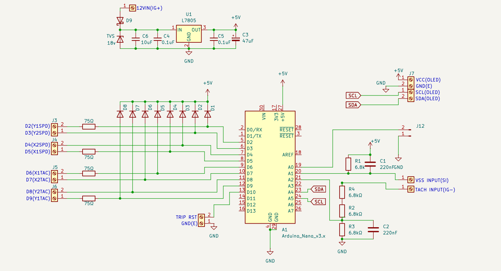
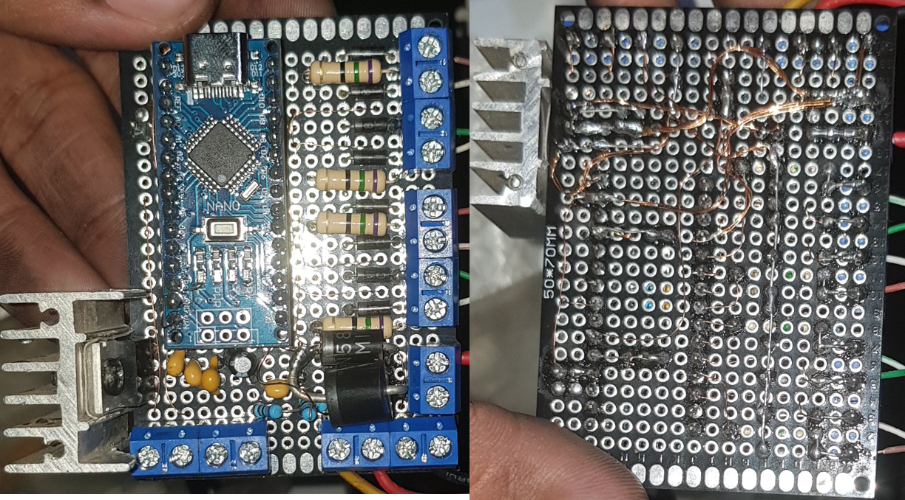
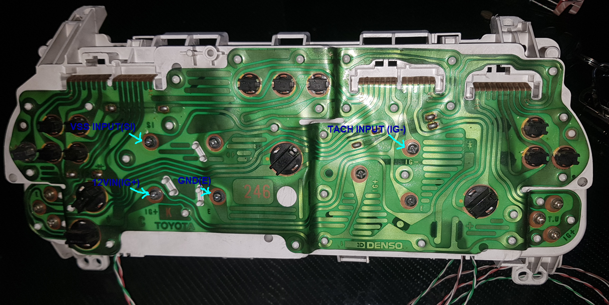
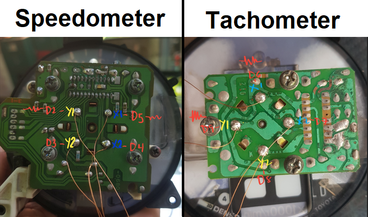
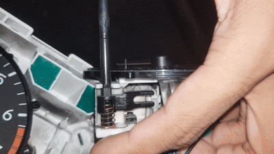

# Corolla-AE101-Speeduino-Instrument-Cluster
This repository documents my step-by-step journey of restoring, converting, and modernizing a broken stock **Toyota Corolla AE101 (7th Gen)** instrument cluster to work seamlessly with a **Speeduino standalone ECU**.

.gif)

## Project Background & The Problem

**Tachometer Signal:** Originally, the stock instrument cluster relied on ignition pulses directly from the distributor. When the engine was converted to a Coil-on-Plug (COP) setup, the distributor was eliminated, requiring a new signal source for the tachometer.

The ideal solution was to feed the tachometer signal directly from the new Speeduino ECU. Initially—back when the car ran the stock ECU and distributor—the tachometer was the only functional gauge on the cluster.

Before bypassing the stock tachometer PCB, we attempted to drive the factory high-voltage analog gauge using the standard **Relay Coil High-Voltage Pulse Generator** adapter circuit:

> *Schematic Credit: PSIG (Speeduino Forum, Oct 2019)*

When we wired using this circuit to the stock gauge input, the needle moved, but the readings were erratic and completely inaccurate. The gauge frequently read double the actual engine RPM (e.g., displaying 1,600 RPM during an 800 RPM idle), making it unusable.

### The Solution: Direct Air-Core Microcontroller Control
Instead of fighting the legacy analog driver circuit, I bypassed it entirely:
1. **Hardware Modification:** Wired the stock air-core gauge coils directly to an **Arduino Nano**.

3. **Interrupt Sampling:** Configured the Nano to read the raw Speeduino 5V tachometer pulse.
To ensure complete accuracy before driving the air-core gauge, we verified the Speeduino tachometer output on an oscilloscope while cross-referencing real-time telemetry in TunerStudio:

* **Measurement 1:** $2,060\text{ RPM} \longrightarrow 66.31\text{ Hz}$ ($\approx 31.06\text{ RPM/Hz}$)
* **Measurement 2:** $2,257\text{ RPM} \longrightarrow 70.27\text{ Hz}$ ($\approx 32.11\text{ RPM/Hz}$)

The scope confirmed a clean 2-pulse per revolution baseline ($1\text{ Hz} = 30\text{ RPM}$).

## 🏎️ Speedometer, VSS & OLED Odometer Modernization

### Project Background & The Problem

**Speedometer & Odometer Signal:** Under factory conditions, the AE101 electronic speedometer operates independently of the ECU, receiving raw pulse streams directly from a 3-wire Vehicle Speed Sensor (VSS) mounted on the transmission. 

When we initially got the car, the speedometer and mechanical odometer were functioning normally. However, during project testing, the gauge circuit randomly died. 

The failure stemmed from two main issues:
1. **Sensor Signal Loss:** Aging internal joints inside the stock VSS caused intermittent pulse signal drops.
2. **Cluster Driver PCB Failure:** The original analog driver circuitry on the cluster board completely quit—meaning even a valid pulse signal could no longer drive the needle or advance the mechanical odometer gear.

---

### The Solution: VSS Restoration, Air-Core Control & Dual OLED Displays

Since the speedometer was being converted to microcontroller control, we also modernized the odometer mechanism instead of relying on the fragile stock mechanical drum:

1. **VSS Hardware Restoration:** Opened, cleaned, and soldered a Hall Effect Sensor in the VSS housing to get a clean 0–5V pulse train.

> *Left: Hall IC embedded into VSS housing. Right: Stock Mechanical drive spindle with multi-pole ring magnet.*

2. **Legacy Mechanical Odometer Removal:** Bypassed the non-functional OEM mechanical drum assembly to make room for a digital display setup inside the original gauge cutout.

> *Left: Stock AE101 mechanical drum assembly and drive motor. Right: Complete teardown of the internal gears, drums, and stepper motor.*

3. **Dual Monochromatic I2C OLED Integration:** Installed two small monochromatic I2C OLED screens into the cluster faceplate—one dedicated to rendering cumulative total distance (Odometer) and the other for a resettable Trip Meter.

> *Bench testing dual 0.96" I2C OLED screens running trip meter and total mileage displays.*

4. **Custom 3D-Printed OLED Mounting:** Without support, the OLED display boards sat loosely behind the cutouts and flapped around inside the housing. To solve this, custom angled PETG brackets were designed and 3D printed to stick the dual displays securely in place against the stock gauge faceplate.

> *Test-fitting the 0.96" OLED display into the speedometer cutout, showing the unanchored board.*

> *Left: Printing custom white PETG mounting brackets. Right: Finished angled screen mounts.*

> *Dual OLED displays mounted securely with the custom brackets.*

> *Complete mechanical assembly behind the OEM gauge face.*

## Building the Circuit

With the signal processing and screen mounting verified on the bench, the complete cluster control system was transferred from breadboard to a permanent, hand-soldered prototype board (protoboard).

### 1. Circuit Schematic & Final Protoboard
The custom cluster driver board combines the Arduino Nano, 12V-to-5V power regulation, VSS signal conditioning, dual I2C OLED display headers, and transistor/PWM driver stages for the air-core gauge coils.

### Schematic: 

> *Left: Top view of the custom protoboard. Right: Bottom view of the custom protoboard.*

### 2. Instrument Cluster Connection.

To supply power and receive sensor signals without altering the original vehicle wiring harness, the custom protoboard taps directly into the stock instrument cluster's rear flexible PCB screw terminals.

> ⚠️ **Important Circuit Isolation Note:**
> To prevent the legacy cluster PCB components from interfering with the Arduino Nano's PWM control of the air-core gauge coils, the original circuit board traces must be completely isolated from the air-core terminal posts. I achieved this by installing rubber **O-rings around the mounting bolt shoulders** to physically break electrical contact with the stock PCB while keeping the gauge mechanics firmly secured.
---

### 3. OEM Toyota Air-Core Motor Pinout

The stock Toyota AE101 air-core gauge movements use a 4-pin quadrant configuration driven by two orthogonal field coils (Sine and Cosine):

> *Terminal pin-assignment for OEM Toyota AE101 air-core gauge motor movement.*

### 4. OEM Trip Meter Reset Stalk Integration

To retain the factory look and feel, the original mechanical trip reset stalk was repurposed to reset the digital trip meter on the OLED display:

> *The original push-stalk mechanism modified with a momentary tactile switch to reset the digital OLED trip meter.*

* **Mechanism:** The stock spring-loaded reset pin triggers a small tactile push switch wired directly to digital input `D12` (`TRIP RST`) on the Arduino board.
* **Firmware Action:** Pressing the physical stalk pulls `D12` low, instantly resetting the OLED trip distance counter back to `0.0 km` and updating the EEPROM storage.

---

## Firmware Code & Schematics

All design files, KiCad schematics, and complete Arduino source code are available in this repository:

* **Schematic** Available in the [`/Schematic`](./Schematic) directory.
* **Arduino Firmware:** Located in the [`/Firmware`](./Firmware) folder.

>  **Note on Development:** 
> The firmware logic—ranging from microsecond input capture and sine/cosine PWM vector driving to dual I2C OLED display rendering—was developed through an iterative **vibe coding** process using AI assistance. Rapidly prototyping and refining algorithms directly in code accelerated the execution of this overhaul.

## Video Demonstrations & Testing

Check out the YouTube videos below to see the bench testing, sweep calibration, and live operation in action:

* 🎬 [Bench Testing & Air-Core Coil Sweeps](https://www.youtube.com/watch?v=YOUR_VIDEO_ID_1) — *Demonstrating air-core needle vector control and OLED display updates.*
* 🎬 [In-Car Live Demonstration & Testing](https://www.youtube.com/watch?v=YOUR_VIDEO_ID_2) — *Full testing of the modernised AE101 instrument cluster connected to the Speeduino ECU.*
